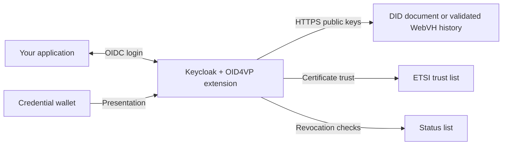

# Keycloak OID4VP

**Digital credentials. Familiar Keycloak login.**

Add wallet sign-in to Keycloak with **did:web- and did:webvh-issued SD-JWT credentials** and **X.509-backed credentials**. The extension requests a presentation, verifies it, and maps disclosed claims into a Keycloak identity or session. Applications keep using their existing Keycloak integration.

Maintained by [su.engineering](https://su.engineering) · [Apache-2.0](LICENSE) · Java 21 · Keycloak 26.5.4 / 26.5.5

[Quick start](docs/quickstart.md) · [Documentation](docs/README.md) · [Configuration](docs/configuration.md) · [Contributing](CONTRIBUTING.md)


*The optional `su-engineering` theme, captured from a running Keycloak instance with synthetic demo data. The existing OpenKYC theme remains available as `openkyc`.*

## What it does

| Capability | Current behavior |
| --- | --- |
| **did:web issuer verification** | Opt-in HTTPS DID resolution for SD-JWT issuer keys, including EC and Ed25519; signature, disclosures, and holder binding are verified. |
| **did:webvh issuer verification** | Opt-in WebVH v1.0 history and witness validation, current assertion keys, and strict key-ID selection. [Setup and limits](docs/did-webvh.md). |
| **Certificate-based verification** | X.509 issuer verification and ETSI trust-list integration; issuer-metadata fallback outside strict X.509 mode. |
| **Credential formats** | SD-JWT VC (`dc+sd-jwt`) and mDoc (`mso_mdoc`). DID support applies to SD-JWT issuer verification. |
| **Wallet interaction** | Same-device links and cross-device QR codes, with server-sent events to resume browser login. |
| **Presentation requests** | Multiple credentials per login, DCQL required/alternative sets and verified claim conditions; `direct_post` and encrypted `direct_post.jwt` responses. |
| **Keycloak integration** | Claim-to-user-attribute and claim-to-session-note mappers; optional transient users. |
| **Login themes** | Neutral `su-engineering` and OpenKYC `openkyc`; select per realm. |

### Project status

`0.1.0-SNAPSHOT` is a development baseline. The did:web SD-JWT flow is deployed, and CI is configured to test both pinned Keycloak versions. Public releases and enterprise support are being prepared.

**Read the [trust limitations](docs/configuration.md#didweb-issuer-verification) before integration.** In particular, the legacy did:web resolver's key authorization and standard path/port handling need further work. The HAIP configuration option is not a certification claim. See the [enterprise readiness plan](docs/enterprise-readiness.md) for the remaining security and operational work.

## Try it locally

You need **Java 21**, **Docker**, and a shell. Maven is downloaded by the pinned wrapper. The first run also downloads dependencies and container images.

```sh
git clone https://github.com/su-engineering/keycloak-oid4vp.git
cd keycloak-oid4vp
./scripts/demo.sh
```

Open the **Sign in** URL printed in the terminal to go directly to the wallet login screen. The demo selects `su-engineering` and creates disposable Keycloak and wallet containers with generated certificates and synthetic credentials. It does not require your sandbox keys or a real wallet.

Follow the [five-minute walkthrough](docs/quickstart.md) to complete a login with the included development wallet. Stop with **Ctrl+C**. This fixture uses `admin/admin` and relaxed test settings; use it only on a trusted development machine.

## How it fits



The wallet proves possession of a credential. The extension verifies the presentation under the realm's configuration, then lets Keycloak complete authentication. The application receives its normal Keycloak response. See [architecture and protocol diagrams](docs/diagrams.md) for the trust boundaries and completion flow.

For multiple credential policies on one server, use [DCQL combinations, multiple providers or separate realms](docs/multiple-credential-types.md). A realm per credential type is optional; separate realms isolate users and SSO.

## Install in an existing Keycloak instance

```sh
./mvnw clean verify
```

This produces `target/keycloak-extension-oid4vp.jar`. Install one copy in Keycloak's `providers/` directory and run Keycloak's build step. Add the **OID4VP** identity provider, configure the credential request and trust policy, then select **Realm settings → Themes → Login theme → su-engineering** if desired.

[Installation guide](docs/installation.md) covers the exact artifact, container build, configuration steps, and validation. [Migration and rollback](docs/migration.md) covers existing deployments.

## did:web configuration

This is an **IdP config fragment**, not a complete realm import:

```json
{
  "didResolutionEnabled": "true",
  "allowedDidMethods": "did:web",
  "didCacheTtlSeconds": "3600",
  "allowedIssuers": "did:web:issuer.example",
  "enforceHaip": "false"
}
```

Also configure the credential type, identifying claim or transient-user mode, and verifier signing material. **The credential issuer's DID and the verifier's signing certificate serve different purposes.** Enabling DID resolution does not remove the wallet's verifier-authentication requirements.

[Configuration reference](docs/configuration.md) explains the resolution order, supported key representations, current limitations, and DCQL mapping.

## Develop and contribute

```sh
./mvnw clean test       # Unit and cryptographic regression tests
./mvnw spotless:apply   # Format Java
./mvnw clean verify     # Format check, unit tests, Docker/browser E2E, coverage
```

Install the test browser once using the command in [development](docs/development.md). Tests exercise both login themes; DID cryptographic tests use generated EC and Ed25519 credentials. Live OIDF conformance is an explicit, separately configured suite.

Bug reports and focused contributions are welcome. Include the Keycloak version, extension revision, reproduction steps, and redacted configuration. Read [CONTRIBUTING.md](CONTRIBUTING.md) and the [code of conduct](CODE_OF_CONDUCT.md). Report vulnerabilities privately to **[security@su.engineering](mailto:security@su.engineering)**; see [SECURITY.md](SECURITY.md).

## Documentation map

| I want to… | Start here |
| --- | --- |
| Run a local wallet login | [Quick start](docs/quickstart.md) |
| Install and configure the provider | [Installation](docs/installation.md) · [Configuration](docs/configuration.md) |
| Select or customize the theme | [Themes and screenshots](docs/themes.md) |
| Understand the implementation | [Architecture](docs/diagrams.md) · [Code walkthrough](docs/request-flow.md) |
| Operate or troubleshoot it | [Operations](docs/operations.md) · [Existing Coolify deployment](deployment/README.md) |
| Test or upgrade it | [Development](docs/development.md) · [Migration](docs/migration.md) |
| Evaluate enterprise readiness | [Readiness plan](docs/enterprise-readiness.md) · [Conformance](docs/conformance.md) |

## License and attribution

Code is licensed under [Apache License 2.0](LICENSE). Retained third-party copyright and attribution are in [NOTICE](NOTICE). The bundled JetBrains Mono font uses the [SIL Open Font License 1.1](src/main/resources/theme/su-engineering/login/resources/fonts/OFL.txt).
