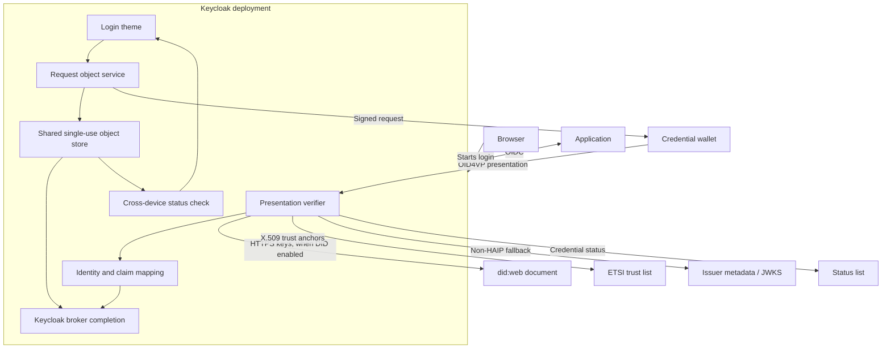
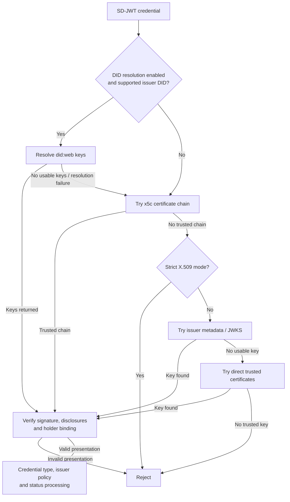

# Architecture and protocol diagrams

The extension runs inside Keycloak as an identity provider. It adds wallet verification to the broker flow; applications continue to authenticate through Keycloak. These diagrams describe this implementation, including optional trust paths. They are not conformance claims.

## Components and trust boundaries



**Trust sources are policy inputs.** A valid signature proves control of a key; issuer authorization depends on configuration and the checks actually implemented. Read [DID limitations](configuration.md#didweb-issuer-verification) and [trust-list signature policy](configuration.md#trust-and-verification).

In a cluster, any node can answer the login page's status polls because each poll reads shared completion state. The authentication session and single-use object store must be available across nodes.

## Login and completion

```mermaid
sequenceDiagram
    autonumber
    actor Person
    participant Browser
    participant Wallet
    participant KC as Keycloak verifier
    participant Trust as Configured trust sources

    Person->>Browser: Start wallet sign-in
    Browser->>KC: OIDC login / identity provider
    KC-->>Browser: Wallet link and QR code
    opt Cross-device
        loop Every poll interval until complete
            Browser->>KC: GET /cross-device/status
            KC-->>Browser: pending
        end
    end
    Person->>Wallet: Open link or scan QR
    Wallet->>KC: Fetch request object
    KC-->>Wallet: Signed DCQL request with nonce and state
    Wallet-->>Person: Show requested credentials and claims
    Person->>Wallet: Review and approve
    Wallet->>KC: POST presentation response
    KC->>Trust: Resolve keys and check configured trust/status
    KC->>KC: Verify signature, disclosure, holder/device binding
    KC->>KC: Store deferred identity; invalidate flow handle
    alt Same-device
        KC-->>Wallet: Return completion URL
        Wallet->>Browser: Open completion URL
    else Cross-device
        KC-->>Wallet: Acknowledge response
        Browser->>KC: GET /cross-device/status
        KC-->>Browser: complete, with completion URL
    end
    Browser->>KC: Complete in the initiating browser session
    KC->>KC: Consume deferred state and run broker flow
    KC-->>Browser: Continue application login
```

The wallet presentation and the browser login are separate requests. The final browser step must match the authentication session that initiated the flow.

## SD-JWT issuer key resolution



DID resolution precedes strict X.509 handling in this baseline. A failed signature under resolved DID keys does not mean “trust the presentation anyway.” See the [code walkthrough](request-flow.md) for the surrounding callback and policy checks, and [configuration](configuration.md) for defaults.

## State lifecycle

| Value | Created | Used for | Invalidated / consumed |
| --- | --- | --- | --- |
| `request_handle` | Once for each enabled device flow when the login page is rendered | Request lookup, browser binding, completion subscription | Successful callback invalidates the flow handle; completion has separate deferred state |
| `state` and `nonce` | Each request-object fetch | Bind the presentation to a particular request instance | Expiry or invalidation of the parent flow |
| Response encryption key | Per encrypted request instance | Decrypt the corresponding `direct_post.jwt` response | Request-context lifetime |
| Deferred identity | After accepted presentation | Resume the broker flow in the original browser | `/complete-auth` consumption or expiry |
| Completion marker | Accepted cross-device response | Let status polls observe completion | Completion consumption or TTL |

Source-level responsibilities and the precise stored keys are documented in [request flow](request-flow.md).
