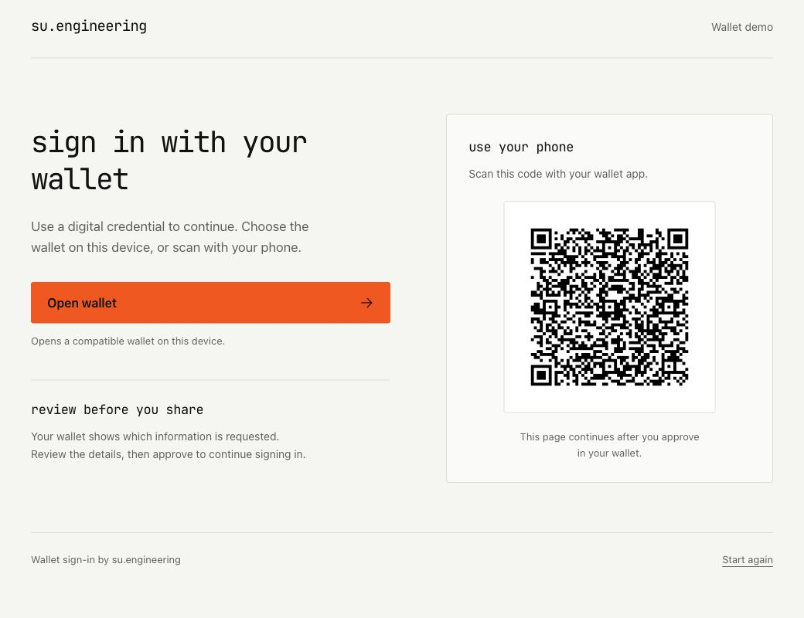

# Run a local wallet login

This walkthrough starts disposable Keycloak and development-wallet containers. It selects the neutral `su-engineering` theme and generates test certificates and credentials. No sandbox files, ngrok account, wallet installation, or production configuration is required.

Allow roughly five minutes after dependencies are cached; initial downloads depend on your connection. This demo exercises the certificate-backed wallet flow. The [DID test suite](development.md#running-tests) separately exercises did:web credential verification.

## 1. Check prerequisites

- Java **21** selected through `JAVA_HOME`.
- Docker running with enough memory for Keycloak and the wallet containers.
- Git and a POSIX shell; Windows users can use WSL with Docker integration.

```sh
java -version
docker info
```

If you use OrbStack or a nonstandard Docker socket, follow [Docker discovery](development.md#docker-discovery) first.

## 2. Start the demo

```sh
./scripts/demo.sh
```

The script builds the provider, starts the test infrastructure, and prints:

```text
Local demo ready (synthetic credentials; admin/admin). Keep this terminal open.
Sign in: http://localhost:<keycloak-port>/realms/wallet-demo/account/
Admin:   http://localhost:<keycloak-port>/admin/
Wallet:  http://localhost:<wallet-port>
```

Ports are assigned dynamically. Use the printed URLs. This test fixture includes three wallet variants used by the regression suite, although the walkthrough uses only the printed wallet.

## 3. Open wallet sign-in

Open **Sign in**. The realm takes you directly to the wallet screen, with the su.engineering wordmark, **Open wallet**, and a QR code.



The `openid4vp://` link normally launches an installed wallet. For this self-contained demo:

1. Copy the address of **Open wallet** using your browser's context menu.
2. Open the printed **Wallet** URL in another tab of the same browser profile.
3. Paste the link in the wallet's **Actions** input and select **Process**.
4. The wallet's **Activity** entry shows a `200` response and a `complete-auth` URL. Open that return URL in the original Keycloak tab.
5. Complete any first-login profile fields with synthetic details. Keycloak then opens the account console.

The development wallet submits synthetic credentials without a real user's consent ceremony. A real wallet has its own review and approval interface. The desktop QR points to this local instance; a physical phone cannot reach `localhost` on your computer through that QR. Use the [HTTPS sandbox workflow](development.md#existing-sandbox-workflows) for real devices.

## 4. Explore configuration

Use the **Admin** URL and `admin/admin`, switch to **wallet-demo**, then inspect:

- **Identity providers → oid4vp** for DCQL, trust, and wallet flow settings.
- **Realm settings → Themes** for `su-engineering` and `openkyc`.
- **Authentication → Flows → wallet-browser** for direct wallet entry. The default provider is `oid4vp`.
- **Identity providers → oid4vp → Mappers** for claim-to-session-note mapping.

The realm has permissive test client settings and generated signing material. It is a learning fixture, not a production realm template. See [installation](installation.md) to configure your own realm.

## 5. Stop

Press **Ctrl+C** in the terminal. The shutdown hook stops and removes the demo containers. There is no persistent database volume; a new run creates fresh test data. Maven dependencies and Docker images remain cached.

## Troubleshooting

| Symptom | Check |
| --- | --- |
| Docker environment not found | Start Docker and check [socket discovery](development.md#docker-discovery). |
| Java release or compiler error | Confirm `JAVA_HOME` points to Java 21. |
| No ready banner | Inspect the terminal for the first container startup error; image downloads can take time. |
| Open wallet does nothing | Use the included wallet workflow above; a custom URI requires an installed handler. |
| Request expired | Select **Start again**, copy a fresh wallet link, and retry. |
| Completion says session mismatch | Open the return URL in the browser profile that started the Keycloak login. |

Next: [install in your own realm](installation.md), [configure did:web](configuration.md#didweb-issuer-verification), or [customize the theme](themes.md).
