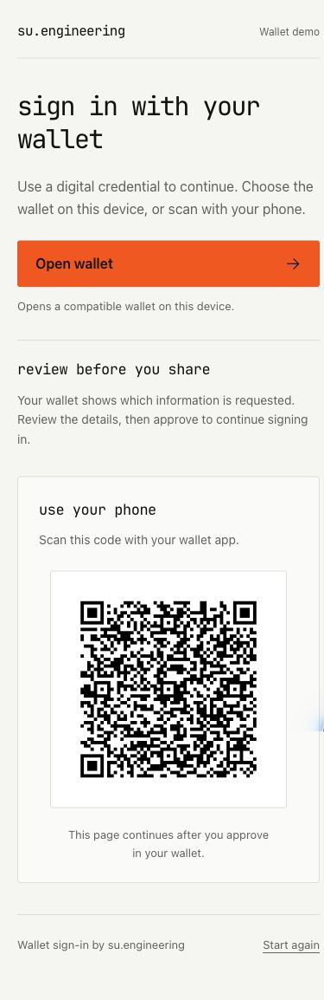
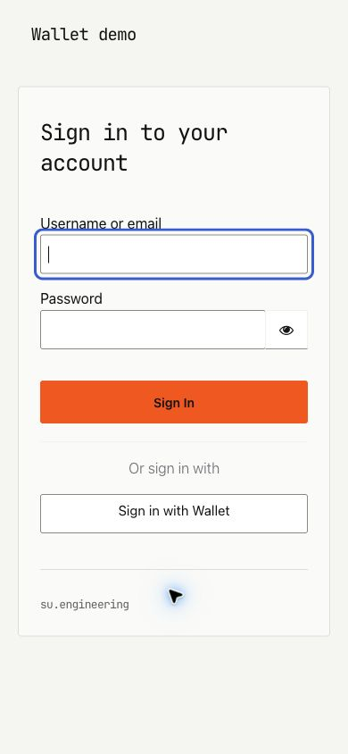

# Login themes

The provider JAR includes two independently selectable login themes. Theme selection changes presentation; issuer verification, request settings, and claim mapping remain provider configuration.

| Theme ID | Appearance | Intended use |
| --- | --- | --- |
| `su-engineering` | Warm off-white, monochrome type, orange actions, generic wallet language | Neutral organization branding and new integrations |
| `oid4vp` | Existing OpenKYC presentation | Existing OpenKYC integrations |

## Select a theme

In the target realm, choose **Realm settings → Themes → Login theme → su-engineering** and save. Start a fresh authentication attempt to see the change.

For a realm import, set the top-level property:

```json
{
  "realm": "your-realm",
  "loginTheme": "su-engineering"
}
```

This is a fragment to merge into your realm configuration. Do not overwrite an existing realm with it. Installing the new JAR does not automatically change any realm's selected theme. To roll back the appearance, select the previous login theme.

## Screenshots

These are actual Keycloak 26.5.5 pages from the disposable local demo, using the realm display name **Wallet demo**. All data and QR sessions are synthetic and disposable.

### Wallet login


### Mobile



### Standard Keycloak login



## Behavior and accessibility

- The page shows only the wallet flows enabled in the IdP configuration. Its instructions adapt to same-device-only and cross-device-only configurations.
- QR codes remain visible on mobile. Opening a wallet uses a regular link; it does not depend on a theme-specific click handler.
- The active wallet provider is omitted from alternative sign-in methods.
- A keyboard-visible skip link, focus outlines, headings, labeled regions, QR alternative text, and a **Start again** link support navigation.
- The palette uses dark text on orange actions; the theme adds no animation and loads its font and stylesheet from Keycloak itself.
- Cross-device completion requires JavaScript; a `noscript` message explains that requirement.
- Standard login, validation, error, account-linking, and first-login forms inherit Keycloak's templates and receive the neutral CSS. This is a **login theme**; it does not restyle the admin or account consoles.

English is bundled. Additional translations belong in the theme's message bundles and `locales` configuration. The UI deliberately avoids claiming a particular credential type, wallet vendor, consent policy, or assurance level.

## Customize

Source: [`src/main/resources/theme/su-engineering/login/`](../src/main/resources/theme/su-engineering/login/).

| File | Responsibility |
| --- | --- |
| `theme.properties` | Inherits `keycloak`, loads the parent login CSS followed by neutral overrides |
| `login-oid4vp-idp.ftl` | Wallet actions, QR, hidden form fields, alternative providers, and SSE configuration |
| `oid4vp-template.ftl` | Dedicated wallet page layout; intentionally omits Keycloak's generic auth checker |
| `footer.ftl` | Branding on inherited forms |
| `resources/css/su-engineering.css` | Palette, spacing, type, responsive layout, and form overrides |
| `messages/messages_en.properties` | Wallet copy and accessibility labels |
| `resources/fonts/` | Local JetBrains Mono font, provenance, and OFL license |

The palette and type variables are declared at the start of the stylesheet. For an organization-specific variant, create a child theme with `parent=su-engineering` and override only the files you need. Keycloak's theme documentation is in the [server development guide](https://www.keycloak.org/docs/latest/server_development/#_themes); verify template compatibility against your pinned runtime.

Preserve `oid4vpForm`, its hidden fields, `oid4vp-open-wallet`, `oid4vp-qr-code`, the wallet URLs, and the `oid4vp-cross-device-sse-config` data attributes. The completion script comes from the shared extension theme resources; do not replace it with a general login-session polling script.

## Preview changes and refresh screenshots

1. Start `./scripts/demo.sh` and follow [quick start](quickstart.md).
2. The demo mounts the neutral theme source and disables theme caching. Edit templates, messages, or CSS, then reload a fresh login page. Changes to Java or bundled shared resources require a rebuild and restart.
3. Inspect desktop and 320–390 px mobile widths. Check focus visibility, wrapping, both flow modes, and the inherited login form.
4. Capture the real page using the browser's screenshot tools. Save desktop wallet, mobile wallet, and standard login captures under `docs/images/` using the existing filenames. Keep the realm name **Wallet demo**; use synthetic credentials only.
5. Update [capture notes](images/README.md) with the runtime, viewport, and date. Do not replace a QR with an invented one or use a production login session.
6. Run `./mvnw verify -Dit.test=KeycloakThemeE2eIT` and review the Markdown preview.

## Existing OpenKYC entry path

The existing `oid4vp` theme is retained byte-for-byte. Its generic `login.ftl` constructs a broker link without the session query parameters. Use the standard OIDC authorization request with `kc_idp_hint=oid4vp` for that theme's direct wallet entry path; fixing the generic OpenKYC link is tracked separately in [enterprise readiness](enterprise-readiness.md). The neutral theme inherits Keycloak's generated provider links and supports the normal sign-in selection page.
